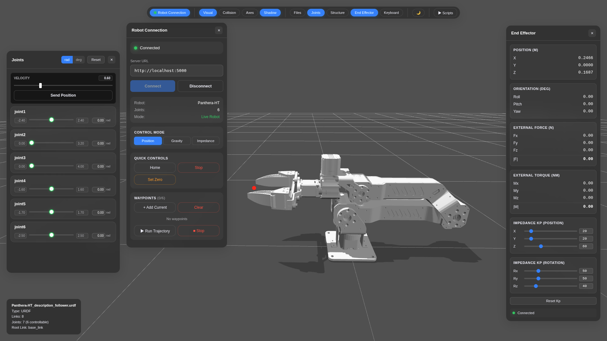

# Panthera-HT Host



这是 Panthera-HT 六轴机械臂的上位机项目。包含真机控制SDK示例和前后端。项目主要用于：

- 连接 Panthera-HT 真机并进行位置、重力补偿、阻抗等控制
- 在浏览器中实时显示机械臂 3D 状态、关节状态和末端状态
- 从 Web 页面运行 `panthera_python/scripts/` 下的 SDK 示例脚本
- 在没有真机时使用 Demo 仿真模式调试前后端界面

第一次上手建议先用 **Demo 模式**，不需要连接真机。

## 快速开始

### 1. 准备环境

使用 Ubuntu20/22/24，并提前安装 Miniconda 或 Anaconda。

然后在项目根目录执行：

```bash
chmod +x install.sh backend.sh frontend.sh
./install.sh
```

安装脚本会创建 conda 环境：

```text
Panthera_host
```

并安装后端、前端和 Panthera Python SDK 需要的依赖。

### 2. 启动后端

新开一个终端，先启动 Demo 模式：

```bash
./backend.sh --demo
```

Demo 模式不会连接真实机械臂，适合开发前端、熟悉界面和调试流程。

### 3. 启动前端

再开一个终端：

```bash
./frontend.sh
```

浏览器打开：

```text
http://localhost:3000
```

看到页面后，就可以在浏览器里查看机械臂状态、控制关节、运行示例脚本。

## 连接真机

真机模式会实际控制机械臂，运行前请确认：

- 机械臂周围安全，没有人或障碍物。
- 电源、串口/CAN 设备已经连接好。
- 使用了正确的机器人配置文件。

启动真机后端：

```bash
./backend.sh
```

这等价于：

```bash
./backend.sh --live --config ../robot_param/Follower.yaml --port 5000
```

如果没有连接真机，请使用：

```bash
./backend.sh --demo
```

## 项目目录

```text
.
├── install.sh                         # 一键安装环境
├── backend.sh                         # 启动后端
├── frontend.sh                        # 启动前端
├── Panthera_digital_twin-main/
│   ├── backend/                       # Flask 后端
│   ├── frontend/                      # Web 前端
│   ├── robot_param/                   # 机器人配置
│   └── Panthera-HT_description/       # URDF 和模型资源
└── panthera_python/
    ├── scripts/                       # SDK 示例脚本
    ├── motor_whl/                     # 电机 SDK wheel
    └── requirements.txt               # Python 依赖
```

## 常改文件

- 后端入口：`Panthera_digital_twin-main/backend/app.py`
- Demo 仿真：`Panthera_digital_twin-main/backend/panthera_sim.py`
- 前端入口：`Panthera_digital_twin-main/frontend/src/main.js`
- 前端界面：`Panthera_digital_twin-main/frontend/src/ui/`
- 示例脚本：`panthera_python/scripts/`
- 默认真机配置：`Panthera_digital_twin-main/robot_param/Follower.yaml`

Web 页面顶部的 `Scripts` 面板会读取 `panthera_python/scripts/` 目录下的一层 `.py` 文件。

## 常用命令

```bash
# 安装环境
./install.sh

# 启动后端：Demo 模式
./backend.sh --demo

# 启动后端：真机模式
./backend.sh

# 启动前端
./frontend.sh

# 指定前端端口
./frontend.sh --port 3001

# 前端构建检查
cd Panthera_digital_twin-main/frontend
npm run build

# 删除 conda 环境
conda env remove -n Panthera_host
```

## 常见问题

### 没有真机怎么开发？

使用 Demo 模式：

```bash
./backend.sh --demo
```

### 前端页面打不开？

确认 `./frontend.sh` 已经启动，并访问：

```text
http://localhost:3000
```

如果 3000 端口被占用，可以换端口：

```bash
./frontend.sh --port 3001
```

### 后端找不到 conda 环境？

先运行：

```bash
./install.sh
```

如果需要重装环境，可以先删除：

```bash
conda env remove -n Panthera_host
```

然后重新执行 `./install.sh`。

### 需要跳过系统依赖安装？

如果只想安装 conda、Python 和 npm 依赖，不想修改系统依赖：

```bash
INSTALL_SYSTEM_DEPS=0 ./install.sh
```

## 更多说明

更详细的数字孪生说明见：

```text
Panthera_digital_twin-main/README.md
```

真机模式和 `panthera_python/scripts/` 下的脚本可能直接控制实际硬件，运行前请先确认脚本内容和现场安全。
