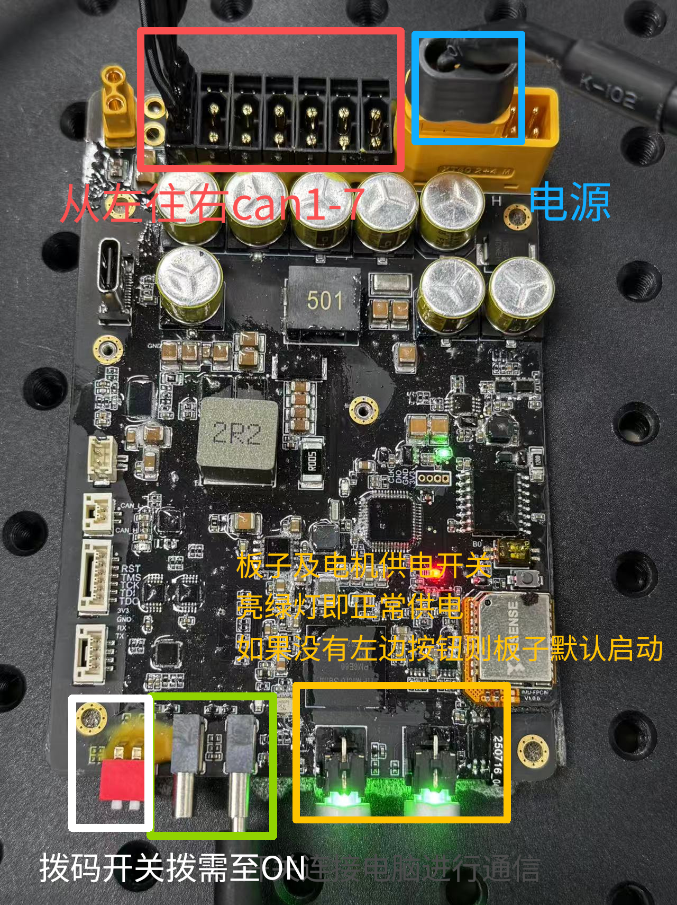

# Panthera Robotic Arm Control Python SDK

A comprehensive Python SDK for controlling Panthera-HT 6-DOF robotic arms. Supports multiple control modes, forward/inverse kinematics, dynamics computation (gravity, Coriolis, friction compensation), trajectory planning (quintic/septic interpolation), master-slave teleoperation, and trajectory record/replay.

---

## Table of Contents

- [Features](#features)
- [Environment Setup](#environment-setup)
- [Usage Guide](#usage-guide)
- [API Reference](#api-reference)
- [Project Structure](#project-structure)
- [Troubleshooting](#troubleshooting)

---

## Features

| Category | Features |
|----------|----------|
| **Control Modes** | Position-Velocity, MIT 5-Parameter (pos+vel+torque+Kp+Kd), Impedance, Gripper |
| **Kinematics** | Forward kinematics (FK), Inverse kinematics (IK) |
| **Dynamics** | Gravity compensation, Coriolis matrix, Mass matrix, Friction compensation (Coulomb + viscous) |
| **Trajectory Planning** | 5th-order (quintic) and 7th-order (septic) polynomial interpolation |
| **Safety** | Joint position limits, torque limits, timeout detection, arrival detection |
| **Cooperative Control** | Master-slave teleoperation, trajectory recording and replay |
| **Configuration** | YAML-based robot parameter files |

---

## Environment Setup

### Prerequisites

- Linux x86_64 or aarch64 system
- Python 3.9, 3.10, 3.11, or 3.12
- Conda (recommended) or virtualenv

### 1. Create a Dedicated Conda Environment

Using a dedicated environment avoids conflicts with system packages (ROS, etc.).

```bash
# Create environment
conda create -n panthera python=3.10
conda activate panthera

# Always use pip (not pip3) inside the conda environment
```

### 2. Install the Motor SDK (Pre-built Wheel)

Choose the `.whl` file matching your Python version and architecture from `motor_whl/`:

```bash
# x86_64 systems:
pip install motor_whl/hightorque_robot-1.2.0-cp310-cp310-linux_x86_64.whl

# aarch64 (Jetson, Raspberry Pi) systems:
pip install motor_whl/hightorque_robot-1.0.0-cp310-cp310-linux_aarch64.whl
```

Available versions in `motor_whl/`:

| Python | x86_64 | aarch64 |
|--------|--------|---------|
| 3.9 | `hightorque_robot-1.2.0-cp39-cp39-linux_x86_64.whl` | `hightorque_robot-1.0.0-cp39-cp39-linux_aarch64.whl` |
| 3.10 | `hightorque_robot-1.2.0-cp310-cp310-linux_x86_64.whl` | `hightorque_robot-1.0.0-cp310-cp310-linux_aarch64.whl` |
| 3.11 | `hightorque_robot-1.2.0-cp311-cp311-linux_x86_64.whl` | `hightorque_robot-1.0.0-cp311-cp311-linux_aarch64.whl` |
| 3.12 | `hightorque_robot-1.2.0-cp312-cp312-linux_x86_64.whl` | `hightorque_robot-1.0.0-cp312-cp312-linux_aarch64.whl` |

### 3. Install High-Level Dependencies

```bash
# Recommended: install all dependencies at once
pip install -r requirements.txt

# Or install individually:
pip install "pyyaml>=6.0"
pip install "pin>=2.6.0"
pip install "scipy>=1.9.0"
```

> **Important:** Install `pin` (the robot dynamics library), **not** `pinocchio`. `pinocchio` is a testing framework, not the package we need.

### 4. Verify Installation

```bash
python -c "import hightorque_robot; print('✓ Motor SDK OK')"
python -c "import pinocchio as pin; print('✓ pin OK')"
python -c "import yaml; print('✓ pyyaml OK')"
```

### 5. Grant Serial Port Permissions

```bash
# Check connected devices (should see 7 ttyACM* devices)
ls /dev/ttyACM*

# Grant permissions
sudo chmod -R 777 /dev/ttyACM*

# Optional: auto-grant on every reboot via udev
echo 'KERNEL=="ttyACM*", MODE="0777"' | sudo tee /etc/udev/rules.d/99-panthera.rules
sudo udevadm control --reload-rules
```

---

## Usage Guide

### Directory Structure for Running Scripts

All scripts should be run from the `scripts/` directory, as `Panthera_lib` is provided as source and imported relative to that path:

```bash
cd panthera_python/scripts/
```

### Quick Test — Check Joint Status

Before running any control program, verify that the robot is connected and responsive:

```bash
python 0_robot_get_state.py
```

Expected output: port numbers, motor IDs, initialization messages, then a continuous loop printing joint positions, velocities, and torques.

### Control Overview

| Script | Purpose |
|--------|---------|
| `0_robot_get_state.py` | Read joint states (position, velocity, torque) |
| `0_robot_set_zero.py` | Set current position as the zero point |
| `1_Joint_PosVel_control.py` | Per-joint position + velocity control with torque limits |
| `1_Joint_Vel_control.py` | Velocity-only control |
| `1_Joint_PD_control.py` | PD position control |
| `1_moveJ_control.py` | Joint-space motion — all joints arrive synchronously at a target |
| `1_forward_kinematics_test.py` | Compute end-effector pose from joint angles |
| `1_inverse_kinematics_test.py` | Solve joint angles from a target Cartesian pose |
| `2_gravity_compensation_control.py` | Gravity compensation mode (zero-force feel) |
| `2_gravity_friction_compensation_control.py` | Gravity + friction compensation |
| `2_Jointimpendence_control_with_gra_pd.py` | Joint impedance control with gravity + PD |
| `2_inv_PosVel_control.py` | IK-based Cartesian position control |
| `3_interpolation_control_zeroVel.py` | Smooth trajectory with zero velocity at endpoints |
| `3_interpolation_control_nozeroVel.py` | Smooth trajectory with non-zero endpoint velocities |
| `3_sin_trajectory_control.py` | Sinusoidal joint trajectory |
| `4_impedance_trajectory_control_with_gra_pd.py` | Trajectory tracking with impedance + gravity + PD |
| `5_teleop_control.py` | Master-slave teleoperation |
| `5_record_trajectory.py` | Record joint trajectory to JSONL file |
| `5_replay_trajectory.py` | Replay a recorded trajectory |
| `6_moveL_pos_control.py` | Cartesian straight-line position control |
| `6_moveL_rotate_control.py` | Cartesian rotation control |

### Master-Slave Teleoperation

1. Connect the follower arm to CAN port 1, master arm to CAN port 2
2. Run the teleoperation script:
   ```bash
   python 5_teleop_control.py
   ```

### Record and Replay a Trajectory

**Record:**
```bash
python 5_record_trajectory.py
```
Press `Ctrl+C` to stop. The trajectory is saved as `trajectory_YYYYMMDD_HHMMSS.jsonl`.

**Replay:**
1. Open `5_replay_trajectory.py` and set `TRAJECTORY_FILE` to the saved path
2. Run:
   ```bash
   python 5_replay_trajectory.py
   ```
3. To replay on the follower arm instead, change `config_path` from `Leader.yaml` to `Follower.yaml`

### Basic Code Example

```python
from Panthera_lib import Panthera
import numpy as np

# Create robot instance (default: Leader config)
robot = Panthera()  # or: Panthera("path/to/Leader.yaml")

# Get current joint positions (radians)
joint_pos = robot.get_current_pos()
print(f"Current joint positions: {joint_pos}")

# Position-Velocity control
target_pos = [0.0, 0.5, -0.5, 0.0, 0.5, 0.0]
target_vel = [0.5, 0.5, 0.5, 0.5, 0.5, 0.5]
max_torque = [10.0, 10.0, 10.0, 5.0, 5.0, 5.0]

# Send command (non-blocking)
robot.Joint_Pos_Vel(target_pos, target_vel, max_torque)

# Send command and wait for arrival
robot.Joint_Pos_Vel(target_pos, target_vel, max_torque,
                    iswait=True, tolerance=0.01, timeout=15.0)

# Gripper control
robot.gripper_open()           # Open gripper
# robot.gripper_close(pos=0.0) # Close gripper
```

---

## API Reference

### Panthera Class

Inherits from `htr.Robot`. Provides high-level control interface.

#### Initialization

```python
robot = Panthera(config_path=None)
```

- `config_path`: Path to the YAML config file. Defaults to `robot_param/Leader.yaml`.

#### State Retrieval

| Method | Returns | Description |
|--------|---------|-------------|
| `get_current_state()` | list | All joint states |
| `get_current_pos()` | ndarray (6,) | Joint positions (rad) |
| `get_current_vel()` | ndarray (6,) | Joint velocities (rad/s) |
| `get_current_torque()` | ndarray (6,) | Joint torques (Nm) |
| `get_current_state_gripper()` | — | Gripper state |
| `get_current_pos_gripper()` | — | Gripper position |
| `get_current_vel_gripper()` | — | Gripper velocity |
| `get_current_torque_gripper()` | — | Gripper torque |

#### Control Commands

**`Joint_Pos_Vel(pos, vel, max_tqu=None, iswait=False, tolerance=0.1, timeout=15.0)`**
Per-joint position-velocity-max-torque control. Each joint's parameters are set independently.
- `pos`: Target positions (6,) in rad
- `vel`: Target velocities (6,) in rad/s
- `max_tqu`: Max torques (6,) in Nm, defaults to config values if None
- `iswait`: If True, blocks until target reached
- `tolerance`: Position tolerance in rad
- `timeout`: Timeout in seconds

**`moveJ(pos, duration, max_tqu=None, iswait=False, tolerance=0.1, timeout=15.0)`**
Joint-space motion — all joints arrive at the target simultaneously.
- `pos`: Target positions (6,) in rad
- `duration`: Motion duration in seconds
- `max_tqu`: Max torques (6,) in Nm

**`pos_vel_tqe_kp_kd(pos, vel, tqe, kp, kd)`**
MIT 5-parameter control mode.
- `pos`: Target position (6,) rad
- `vel`: Target velocity (6,) rad/s
- `tqe`: Feed-forward torque (6,) Nm
- `kp`: Position gain (6,)
- `kd`: Velocity gain (6,)

**Gripper:**
- `gripper_control(pos, vel, max_tqu)` — Position-velocity gripper control
- `gripper_control_MIT(pos, vel, tqe, kp, kd)` — MIT mode gripper control
- `gripper_open(vel=0.5, max_tqu=0.5)` — Open gripper
- `gripper_close(pos=0.0, vel=0.5, max_tqu=0.5)` — Close gripper

#### Position Checking

- `check_position_reached(target_positions, tolerance=0.1)` — Returns bool, checks if all joints are within tolerance of target
- `wait_for_position(target_positions, tolerance=0.01, timeout=15.0)` — Blocks until target reached or timeout

#### Kinematics

**`forward_kinematics(joint_angles=None)`**
Computes end-effector pose from joint angles.
- Returns: `{'position': [x,y,z], 'rotation': R, 'transform': T, 'joint_angles': q}`

**`inverse_kinematics(target_position, target_rotation=None, init_q=None, max_iter=1000, eps=1e-4)`**
Solves joint angles from target Cartesian pose.
- `target_position`: [x, y, z] in meters
- `target_rotation`: 3x3 rotation matrix (optional)
- `init_q`: Initial joint angle guess (optional)
- Returns: joint angles (6,) or None if IK fails

#### Dynamics

| Method | Returns | Description |
|--------|---------|-------------|
| `get_Gravity(q=None)` | ndarray (6,) | Gravity compensation torque G(q) |
| `get_Coriolis(q=None, v=None)` | ndarray (6,6) | Coriolis matrix C(q,v) |
| `get_Coriolis_vector(q=None, v=None)` | ndarray (6,) | Coriolis vector C(q,v)*v |
| `get_Mass_Matrix(q=None)` | ndarray (6,6) | Mass/inertia matrix M(q) |
| `get_Inertia_Terms(q=None, a=None)` | ndarray (6,) | Inertia torque M(q)*a |
| `get_Dynamics(q=None, v=None, a=None)` | ndarray (6,) | Full dynamics: τ = M(q)a + C(q,v)v + G(q) |
| `get_friction_compensation(vel=None, Fc=None, Fv=None, vel_threshold=0.01)` | ndarray (6,) | Coulomb + viscous friction: τ = Fc·sign(v) + Fv·v |

#### Trajectory Planning

All interpolation methods return `(position, velocity, acceleration)`.

- `quintic_interpolation(start_pos, end_pos, duration, current_time)` — 5th-order polynomial, continuous velocity and acceleration
- `septic_interpolation(start_pos, end_pos, duration, current_time)` — 7th-order polynomial, continuous velocity, acceleration, and jerk
- `septic_interpolation_with_velocity(start_pos, end_pos, start_vel, end_vel, duration, current_time)` — 7th-order with explicit start/end velocity constraints

#### Inherited Base Methods

| Method | Description |
|--------|-------------|
| `motor_send_cmd()` | Send control command to motors |
| `send_get_motor_state_cmd()` | Request motor state |
| `set_stop()` | Stop all motors |
| `set_reset()` | Reset all motors |
| `set_timeout(timeout_ms)` | Set communication timeout |

### Motor Parameter Configuration

The `robot_param/motor_param/` directory contains YAML files with low-level motor settings: motor ID, CAN bus configuration, motor model, and PID gains.

---

## Project Structure

```
panthera_python/
├── motor_whl/                     # Pre-built SDK packages (one per Python version)
│   └── hightorque_robot-*.whl
│
├── Panthera-HT_description/       # URDF model + STL meshes for visualization
│   ├── urdf/                      # URDF definition files
│   ├── meshes/                    # 3D mesh files (STL)
│   ├── config/                    # Joint name config
│   └── launch/                    # ROS launch files (Gazebo, display)
│
├── robot_param/                   # Robot configuration files
│   ├── Leader.yaml                # Master arm config
│   ├── Follower.yaml              # Follower arm config
│   ├── LeftFollower.yaml          # Left follower arm config
│   └── motor_param/               # Motor parameters (IDs, CAN bus, etc.)
│
├── scripts/                       # All runnable scripts
│   ├── Panthera_lib/              # High-level library (import as source)
│   │   ├── Panthera.py            # Main Panthera class
│   │   └── recorder.py            # Trajectory recorder
│   │
│   ├── 0_robot_get_state.py       # [First run] Check joint status
│   ├── 0_robot_set_zero.py        # Set encoder zero
│   ├── 1_Joint_PosVel_control.py  # Per-joint pos/vel control
│   ├── 1_Joint_Vel_control.py     # Velocity control
│   ├── 1_Joint_PD_control.py      # PD control
│   ├── 1_moveJ_control.py         # Joint-space synchronous movement
│   ├── 1_forward_kinematics_test.py
│   ├── 1_inverse_kinematics_test.py
│   ├── 2_gravity_compensation_control.py
│   ├── 2_gravity_friction_compensation_control.py
│   ├── 2_Jointimpendence_control_with_gra_pd.py
│   ├── 2_Jointimpendence_control_with_gra_fri_pd.py
│   ├── 2_inv_PosVel_control.py
│   ├── 3_interpolation_control_zeroVel.py
│   ├── 3_interpolation_control_nozeroVel.py
│   ├── 3_sin_trajectory_control.py
│   ├── 3_gravity_compensation_with_fk.py
│   ├── 4_impedance_trajectory_control_with_gra_pd.py
│   ├── 5_teleop_control.py        # Master-slave teleoperation
│   ├── 5_record_trajectory.py     # Record trajectory to .jsonl
│   ├── 5_replay_trajectory.py     # Replay trajectory from .jsonl
│   ├── 6_moveL_pos_control.py     # Cartesian linear motion
│   ├── 6_moveL_rotate_control.py  # Cartesian rotation
│   └── motor_example/             # Low-level motor control demos
│       ├── 01_motor_get_status.py
│       ├── 02_position_control.py
│       ├── 03_velocity_control.py
│       ├── 04_torque_control.py
│       ├── 05_voltage_control.py
│       ├── 06_current_control.py
│       ├── 07_pos_vel_maxtorque_control.py
│       ├── 08_pos_vel_torque_kp_kd_control.py
│       └── 09_set_zero.py
│
├── images/                        # Documentation images
├── requirements.txt               # Python dependencies
├── setup.py                       # Package setup script
├── pyproject.toml                 # Project metadata
└── README.md
```

---

## Troubleshooting

### URDF Loading Failed
Check the URDF path in the config file. Paths are relative to the config file's directory.

### Inverse Kinematics Not Converging
Ensure the target position is within the robot's workspace. Increase `max_iter` or adjust the initial guess `init_q`.

### Motor Connection Failure
- Verify the power switch is on (green LED on motor power button)
- Check that all motor-to-motor cables are securely connected
- Run `ls /dev/ttyACM*` to verify USB communication
- Ensure serial port permissions are granted: `sudo chmod -R 777 /dev/ttyACM*`

### ImportError: libserialport.so.0
```bash
sudo apt-get update
sudo apt-get install libserialport-dev
```

### ImportError: libyaml-cpp.so.0.6
The hightorque_robot SDK requires yaml-cpp 0.6. If your system has 0.7:
```bash
cd ~
git clone https://github.com/jbeder/yaml-cpp.git
cd yaml-cpp
git checkout yaml-cpp-0.6.1
mkdir build && cd build
cmake .. -DCMAKE_BUILD_TYPE=Release -DBUILD_SHARED_LIBS=ON
make -j$(nproc)
sudo make install
sudo ldconfig
```

---

## Base Coordinate Reference


## Communication Board Wiring



---

## License

MIT License

## Contributing

Issues and Pull Requests are welcome!

---

<br>

---

<br>

# Panthera 机械臂控制 Python SDK

Panthera-HT 六轴机械臂的 Python 控制 SDK。支持多种控制模式、正逆运动学、动力学计算（重力/科氏力/摩擦力补偿）、轨迹规划（五次/七次多项式插值）、主从遥操作和轨迹记录回放。

---

## 目录

- [功能特性](#功能特性)
- [环境配置](#环境配置)
- [使用指南](#使用指南)
- [API 参考](#api-参考)
- [项目结构](#项目结构)
- [故障排除](#故障排除)

---

## 功能特性

| 类别 | 功能 |
|------|------|
| **控制模式** | 位置速度控制、MIT 五参数控制（位置+速度+力矩+Kp+Kd）、阻抗控制、夹爪控制 |
| **运动学** | 正运动学 (FK)、逆运动学 (IK) |
| **动力学** | 重力补偿、科氏力矩阵、质量矩阵、摩擦力补偿（库仑+粘滞） |
| **轨迹规划** | 五次多项式插值、七次多项式插值、带速度约束的七次多项式插值 |
| **安全保护** | 关节位置限位、力矩限制、超时检测、到位检测 |
| **协同控制** | 主从遥操作、轨迹记录与回放 |
| **配置系统** | 基于 YAML 的机器人参数文件 |

---

## 环境配置

### 系统要求

- Linux x86_64 或 aarch64 系统
- Python 3.9 / 3.10 / 3.11 / 3.12
- Conda（推荐）或 virtualenv

### 1. 创建独立的 Conda 环境

建议创建独立环境以避免与系统包（如 ROS）产生冲突：

```bash
# 创建环境
conda create -n panthera python=3.10
conda activate panthera

# 在 conda 环境中始终使用 pip，不要用 pip3
```

### 2. 安装电机控制 SDK（预编译 whl）

根据 Python 版本和系统架构，从 `motor_whl/` 中选择对应的 whl 文件：

```bash
# x86_64 系统：
pip install motor_whl/hightorque_robot-1.2.0-cp310-cp310-linux_x86_64.whl

# aarch64 系统（Jetson、树莓派等）：
pip install motor_whl/hightorque_robot-1.0.0-cp310-cp310-linux_aarch64.whl
```

`motor_whl/` 目录下提供的版本：

| Python | x86_64 | aarch64 |
|--------|--------|---------|
| 3.9 | `hightorque_robot-1.2.0-cp39-cp39-linux_x86_64.whl` | `hightorque_robot-1.0.0-cp39-cp39-linux_aarch64.whl` |
| 3.10 | `hightorque_robot-1.2.0-cp310-cp310-linux_x86_64.whl` | `hightorque_robot-1.0.0-cp310-cp310-linux_aarch64.whl` |
| 3.11 | `hightorque_robot-1.2.0-cp311-cp311-linux_x86_64.whl` | `hightorque_robot-1.0.0-cp311-cp311-linux_aarch64.whl` |
| 3.12 | `hightorque_robot-1.2.0-cp312-cp312-linux_x86_64.whl` | `hightorque_robot-1.0.0-cp312-cp312-linux_aarch64.whl` |

### 3. 安装高层依赖

```bash
# 推荐：一次性安装所有依赖
pip install -r requirements.txt

# 或逐个安装：
pip install "pyyaml>=6.0"
pip install "pin>=2.6.0"
pip install "scipy>=1.9.0"
```

> **重要提示：** 安装 `pin`（机器人动力学库），**不是** `pinocchio`。`pinocchio` 是一个测试框架，不是我们需要的包。

### 4. 验证安装

```bash
python -c "import hightorque_robot; print('✓ 电机 SDK 安装成功')"
python -c "import pinocchio as pin; print('✓ pin 安装成功')"
python -c "import yaml; print('✓ pyyaml 安装成功')"
```

### 5. 赋串口权限

```bash
# 查看已连接的设备（应能看到 7 个 ttyACM* 设备）
ls /dev/ttyACM*

# 赋权
sudo chmod -R 777 /dev/ttyACM*

# 可选：通过 udev 规则自动赋权（重启后仍然有效）
echo 'KERNEL=="ttyACM*", MODE="0777"' | sudo tee /etc/udev/rules.d/99-panthera.rules
sudo udevadm control --reload-rules
```

---

## 使用指南

### 运行目录

所有脚本都需在 `scripts/` 目录下运行，因为 `Panthera_lib` 是通过相对路径导入的源码：

```bash
cd panthera_python/scripts/
```

### 快速测试 — 查看关节状态

首次使用或每次连接机器人后，先运行状态查看脚本确认通信正常：

```bash
python 0_robot_get_state.py
```

正常输出：端口号、电机 ID、初始化信息，然后持续循环打印各关节的位置、速度、力矩数据。

### 脚本概述

| 脚本 | 用途 |
|------|------|
| `0_robot_get_state.py` | 读取关节状态（位置、速度、力矩） |
| `0_robot_set_zero.py` | 将当前位置设为零点 |
| `1_Joint_PosVel_control.py` | 单关节位置速度控制（带力矩限制） |
| `1_Joint_Vel_control.py` | 纯速度控制 |
| `1_Joint_PD_control.py` | PD 位置控制 |
| `1_moveJ_control.py` | 关节空间运动——所有关节同步到达目标 |
| `1_forward_kinematics_test.py` | 由关节角度计算末端位姿 |
| `1_inverse_kinematics_test.py` | 由目标位姿求解关节角度 |
| `2_gravity_compensation_control.py` | 重力补偿模式（零力感） |
| `2_gravity_friction_compensation_control.py` | 重力 + 摩擦力补偿 |
| `2_Jointimpendence_control_with_gra_pd.py` | 关节阻抗控制（重力 + PD） |
| `2_inv_PosVel_control.py` | 基于逆运动学的笛卡尔位置控制 |
| `3_interpolation_control_zeroVel.py` | 端点速度为零的平滑轨迹 |
| `3_interpolation_control_nozeroVel.py` | 端点速度非零的平滑轨迹 |
| `3_sin_trajectory_control.py` | 正弦轨迹 |
| `4_impedance_trajectory_control_with_gra_pd.py` | 阻抗 + 重力 + PD 轨迹跟踪 |
| `5_teleop_control.py` | 主从遥操作 |
| `5_record_trajectory.py` | 记录关节轨迹到 JSONL 文件 |
| `5_replay_trajectory.py` | 回放已记录的轨迹 |
| `6_moveL_pos_control.py` | 笛卡尔空间直线位置控制 |
| `6_moveL_rotate_control.py` | 笛卡尔空间旋转控制 |

### 主从遥操作

1. 将从臂连接至 CAN 口 1，主臂连接至 CAN 口 2
2. 运行遥操作脚本：
   ```bash
   python 5_teleop_control.py
   ```

### 轨迹记录与回放

**记录轨迹：**
```bash
python 5_record_trajectory.py
```
按 `Ctrl+C` 停止录制，轨迹自动保存为 `trajectory_YYYYMMDD_HHMMSS.jsonl`。

**回放轨迹：**
1. 编辑 `5_replay_trajectory.py`，修改 `TRAJECTORY_FILE` 为轨迹文件路径
2. 运行：
   ```bash
   python 5_replay_trajectory.py
   ```
3. 如需在从臂上回放，将代码中的 `Leader.yaml` 改为 `Follower.yaml`

### 基础代码示例

```python
from Panthera_lib import Panthera
import numpy as np

# 创建机械臂实例（默认使用 Leader 配置）
robot = Panthera()  # 或: Panthera("path/to/Leader.yaml")

# 获取当前关节角度（弧度）
joint_pos = robot.get_current_pos()
print(f"当前关节角度: {joint_pos}")

# 位置速度控制
target_pos = [0.0, 0.5, -0.5, 0.0, 0.5, 0.0]
target_vel = [0.5, 0.5, 0.5, 0.5, 0.5, 0.5]
max_torque = [10.0, 10.0, 10.0, 5.0, 5.0, 5.0]

# 发送命令（非阻塞）
robot.Joint_Pos_Vel(target_pos, target_vel, max_torque)

# 发送命令并等待到达
robot.Joint_Pos_Vel(target_pos, target_vel, max_torque,
                    iswait=True, tolerance=0.01, timeout=15.0)

# 夹爪控制
robot.gripper_open()           # 打开夹爪
# robot.gripper_close(pos=0.0) # 关闭夹爪
```

---

## API 参考

### Panthera 类

继承自 `htr.Robot`，提供机械臂级别的高层控制接口。

#### 初始化

```python
robot = Panthera(config_path=None)
```

- `config_path`: YAML 配置文件路径，默认为 `robot_param/Leader.yaml`

#### 状态获取

| 方法 | 返回类型 | 说明 |
|------|---------|------|
| `get_current_state()` | list | 所有关节的完整状态 |
| `get_current_pos()` | ndarray (6,) | 关节位置（弧度） |
| `get_current_vel()` | ndarray (6,) | 关节速度（弧度/秒） |
| `get_current_torque()` | ndarray (6,) | 关节力矩（牛米） |
| `get_current_state_gripper()` | — | 夹爪状态 |
| `get_current_pos_gripper()` | — | 夹爪位置 |
| `get_current_vel_gripper()` | — | 夹爪速度 |
| `get_current_torque_gripper()` | — | 夹爪力矩 |

#### 控制命令

**`Joint_Pos_Vel(pos, vel, max_tqu=None, iswait=False, tolerance=0.1, timeout=15.0)`**
单关节位置速度最大力矩控制，每个关节独立设置参数。
- `pos`: 目标位置 (6,)，弧度
- `vel`: 目标速度 (6,)，弧度/秒
- `max_tqu`: 最大力矩 (6,)，牛米，为 None 时使用配置文件默认值
- `iswait`: 为 True 时阻塞直至到达目标
- `tolerance`: 位置容差（弧度）
- `timeout`: 超时时间（秒）

**`moveJ(pos, duration, max_tqu=None, iswait=False, tolerance=0.1, timeout=15.0)`**
关节空间运动——所有关节同步到达目标位置。
- `pos`: 目标位置 (6,)，弧度
- `duration`: 运动时间（秒）
- `max_tqu`: 最大力矩 (6,)，牛米

**`pos_vel_tqe_kp_kd(pos, vel, tqe, kp, kd)`**
MIT 五参数控制模式。
- `pos`: 目标位置 (6,)，弧度
- `vel`: 目标速度 (6,)，弧度/秒
- `tqe`: 前馈力矩 (6,)，牛米
- `kp`: 位置增益 (6,)
- `kd`: 速度增益 (6,)

**夹爪控制：**
- `gripper_control(pos, vel, max_tqu)` — 位置速度夹爪控制
- `gripper_control_MIT(pos, vel, tqe, kp, kd)` — MIT 模式夹爪控制
- `gripper_open(vel=0.5, max_tqu=0.5)` — 打开夹爪
- `gripper_close(pos=0.0, vel=0.5, max_tqu=0.5)` — 关闭夹爪

#### 位置检测

- `check_position_reached(target_positions, tolerance=0.1)` — 返回 bool，检查所有关节是否在容差内到达目标
- `wait_for_position(target_positions, tolerance=0.01, timeout=15.0)` — 阻塞直至到达目标或超时

#### 运动学

**`forward_kinematics(joint_angles=None)`**
由关节角度计算末端位姿。
- 返回: `{'position': [x,y,z], 'rotation': R, 'transform': T, 'joint_angles': q}`

**`inverse_kinematics(target_position, target_rotation=None, init_q=None, max_iter=1000, eps=1e-4)`**
由目标笛卡尔位姿求解关节角度。
- `target_position`: [x, y, z]，单位米
- `target_rotation`: 3x3 旋转矩阵（可选）
- `init_q`: 初始关节角度猜测值（可选）
- 返回: 关节角度 (6,) 或 None（IK 失败）

#### 动力学

| 方法 | 返回类型 | 说明 |
|------|---------|------|
| `get_Gravity(q=None)` | ndarray (6,) | 重力补偿力矩 G(q) |
| `get_Coriolis(q=None, v=None)` | ndarray (6,6) | 科氏力矩阵 C(q,v) |
| `get_Coriolis_vector(q=None, v=None)` | ndarray (6,) | 科氏力向量 C(q,v)*v |
| `get_Mass_Matrix(q=None)` | ndarray (6,6) | 质量矩阵 M(q) |
| `get_Inertia_Terms(q=None, a=None)` | ndarray (6,) | 惯性力矩 M(q)*a |
| `get_Dynamics(q=None, v=None, a=None)` | ndarray (6,) | 完整动力学：τ = M(q)a + C(q,v)v + G(q) |
| `get_friction_compensation(vel=None, Fc=None, Fv=None, vel_threshold=0.01)` | ndarray (6,) | 库仑+粘滞摩擦：τ = Fc·sign(v) + Fv·v |

#### 轨迹规划

所有插值方法返回 `(position, velocity, acceleration)` 三元组。

- `quintic_interpolation(start_pos, end_pos, duration, current_time)` — 五次多项式，速度和加速度连续
- `septic_interpolation(start_pos, end_pos, duration, current_time)` — 七次多项式，速度、加速度、加加速度连续
- `septic_interpolation_with_velocity(start_pos, end_pos, start_vel, end_vel, duration, current_time)` — 七次多项式，带起止速度约束

#### 继承的基础方法

| 方法 | 说明 |
|------|------|
| `motor_send_cmd()` | 发送控制命令到电机 |
| `send_get_motor_state_cmd()` | 请求电机状态 |
| `set_stop()` | 停止所有电机 |
| `set_reset()` | 重启所有电机 |
| `set_timeout(timeout_ms)` | 设置通信超时 |

---

## 项目结构

```
panthera_python/
├── motor_whl/                     # 预编译 SDK 包（每个 Python 版本一个）
│   └── hightorque_robot-*.whl
│
├── Panthera-HT_description/       # URDF 模型 + STL 网格（用于可视化）
│   ├── urdf/                      # URDF 定义文件
│   ├── meshes/                    # 3D 网格文件（STL）
│   ├── config/                    # 关节名称配置
│   └── launch/                    # ROS 启动文件（Gazebo, display）
│
├── robot_param/                   # 机器人配置文件
│   ├── Leader.yaml                # 主臂配置
│   ├── Follower.yaml              # 从臂配置
│   ├── LeftFollower.yaml          # 左从臂配置
│   └── motor_param/               # 电机参数（ID、CAN 总线等）
│
├── scripts/                       # 所有可运行脚本
│   ├── Panthera_lib/              # 高层封装库（源码方式导入）
│   │   ├── Panthera.py            # Panthera 主类
│   │   └── recorder.py            # 轨迹记录器
│   │
│   ├── 0_robot_get_state.py       # [首次运行] 查看关节状态
│   ├── 0_robot_set_zero.py        # 设置编码器零位
│   ├── 1_Joint_PosVel_control.py  # 单关节位置速度控制
│   ├── 1_Joint_Vel_control.py     # 速度控制
│   ├── 1_Joint_PD_control.py      # PD 控制
│   ├── 1_moveJ_control.py         # 关节空间同步运动
│   ├── 1_forward_kinematics_test.py  # 正运动学测试
│   ├── 1_inverse_kinematics_test.py  # 逆运动学测试
│   ├── 2_gravity_compensation_control.py             # 重力补偿
│   ├── 2_gravity_friction_compensation_control.py    # 重力+摩擦力补偿
│   ├── 2_Jointimpendence_control_with_gra_pd.py      # 关节阻抗（重力+PD）
│   ├── 2_Jointimpendence_control_with_gra_fri_pd.py  # 关节阻抗（重力+摩擦力+PD）
│   ├── 2_inv_PosVel_control.py        # 基于IK的位置控制
│   ├── 3_interpolation_control_zeroVel.py     # 插值轨迹（零速度端点）
│   ├── 3_interpolation_control_nozeroVel.py   # 插值轨迹（非零速度端点）
│   ├── 3_sin_trajectory_control.py            # 正弦轨迹
│   ├── 3_gravity_compensation_with_fk.py      # 重力补偿+正运动学
│   ├── 4_impedance_trajectory_control_with_gra_pd.py  # 基于轨迹的阻抗控制
│   ├── 5_teleop_control.py             # 主从遥操作
│   ├── 5_record_trajectory.py          # 记录轨迹到 .jsonl
│   ├── 5_replay_trajectory.py          # 从 .jsonl 回放轨迹
│   ├── 6_moveL_pos_control.py          # 笛卡尔直线运动
│   ├── 6_moveL_rotate_control.py       # 笛卡尔旋转运动
│   └── motor_example/                  # 底层电机控制示例
│       ├── 01_motor_get_status.py
│       ├── 02_position_control.py
│       ├── 03_velocity_control.py
│       ├── 04_torque_control.py
│       ├── 05_voltage_control.py
│       ├── 06_current_control.py
│       ├── 07_pos_vel_maxtorque_control.py
│       ├── 08_pos_vel_torque_kp_kd_control.py
│       └── 09_set_zero.py
│
├── images/                        # 文档图片
├── requirements.txt               # Python 依赖列表
├── setup.py                       # 安装脚本
├── pyproject.toml                 # 项目元数据
└── README.md
```

---

## 故障排除

### URDF 加载失败
检查配置文件中的 URDF 路径是否正确，路径相对于配置文件所在目录解析。

### 逆运动学不收敛
确保目标位置在机械臂工作空间内，可增加 `max_iter` 或调整初值 `init_q`。

### 电机无法连接
- 检查电源开关（电机电源按钮亮绿灯为已上电）
- 检查电机之间的连接线是否牢固
- 运行 `ls /dev/ttyACM*` 确认 USB 通信正常
- 确保串口权限已赋值：`sudo chmod -R 777 /dev/ttyACM*`

### ImportError: libserialport.so.0

```bash
sudo apt-get update
sudo apt-get install libserialport-dev
```

### ImportError: libyaml-cpp.so.0.6

hightorque_robot SDK 需要 yaml-cpp 0.6 版本。如果系统安装的是 0.7，需要降级：

```bash
cd ~
git clone https://github.com/jbeder/yaml-cpp.git
cd yaml-cpp
git checkout yaml-cpp-0.6.1
mkdir build && cd build
cmake .. -DCMAKE_BUILD_TYPE=Release -DBUILD_SHARED_LIBS=ON
make -j$(nproc)
sudo make install
sudo ldconfig
```

---

## 许可证

MIT License
